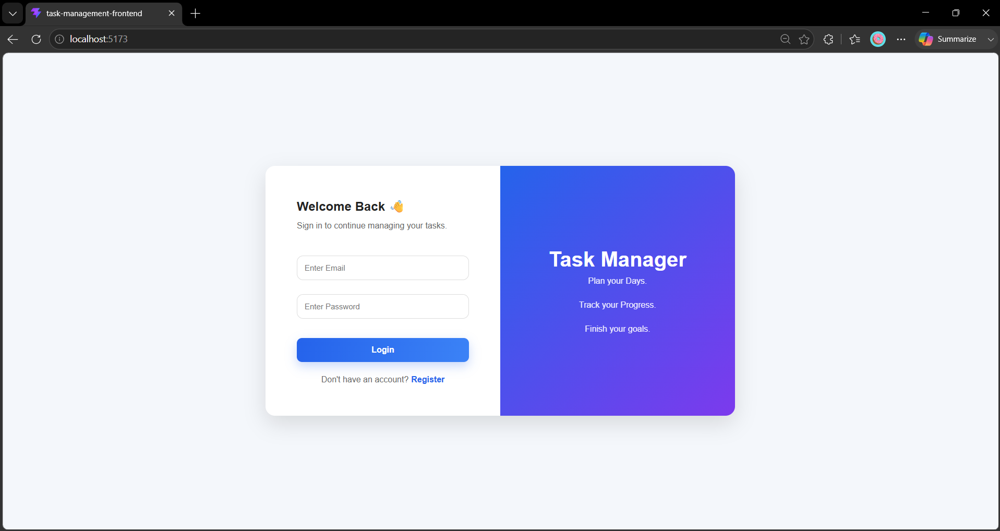

# 📋 Task Management System

A full-stack Task Management System built using **Spring Boot**, **React**, **JWT Authentication**, and **MySQL**. It allows users to securely register, log in, and manage their personal tasks with search, filtering, and profile management.

---

## 🚀 Features

- 🔐 JWT Authentication
- 👤 User Registration & Login
- ✅ Create, Update, Delete Tasks
- 🔍 Search Tasks
- 📌 Filter by Status
- ⭐ Filter by Priority
- 📊 Dashboard Statistics
- 📅 Upcoming Deadlines
- 👤 Profile Page
- 🔒 Change Password
- 🎨 Responsive UI

---

## 🛠️ Tech Stack

### Backend
- Java 23
- Spring Boot
- Spring Security
- Hibernate / JPA
- MySQL
- JWT
- Maven

### Frontend
- React
- React Router
- Axios
- CSS
- React Icons

---

## 📂 Project Structure

```text
task-management-system
│
├── backend
│
├── frontend
│
└── README.md
```

---

## ⚙️ Installation

### Backend

```bash
cd backend
mvn spring-boot:run
```

### Frontend

```bash
cd frontend
npm install
npm run dev
```

---

## 🔑 Authentication

- JWT-based Authentication
- Passwords encrypted using BCrypt
- Protected APIs with Spring Security

---

## 📸 Screenshots

- Login
  
- Register
- Dashboard
- My Tasks
- Profile

---

## 👨‍💻 Author

**Shaik Khadar Vali**

GitHub: https://github.com/khadars90
